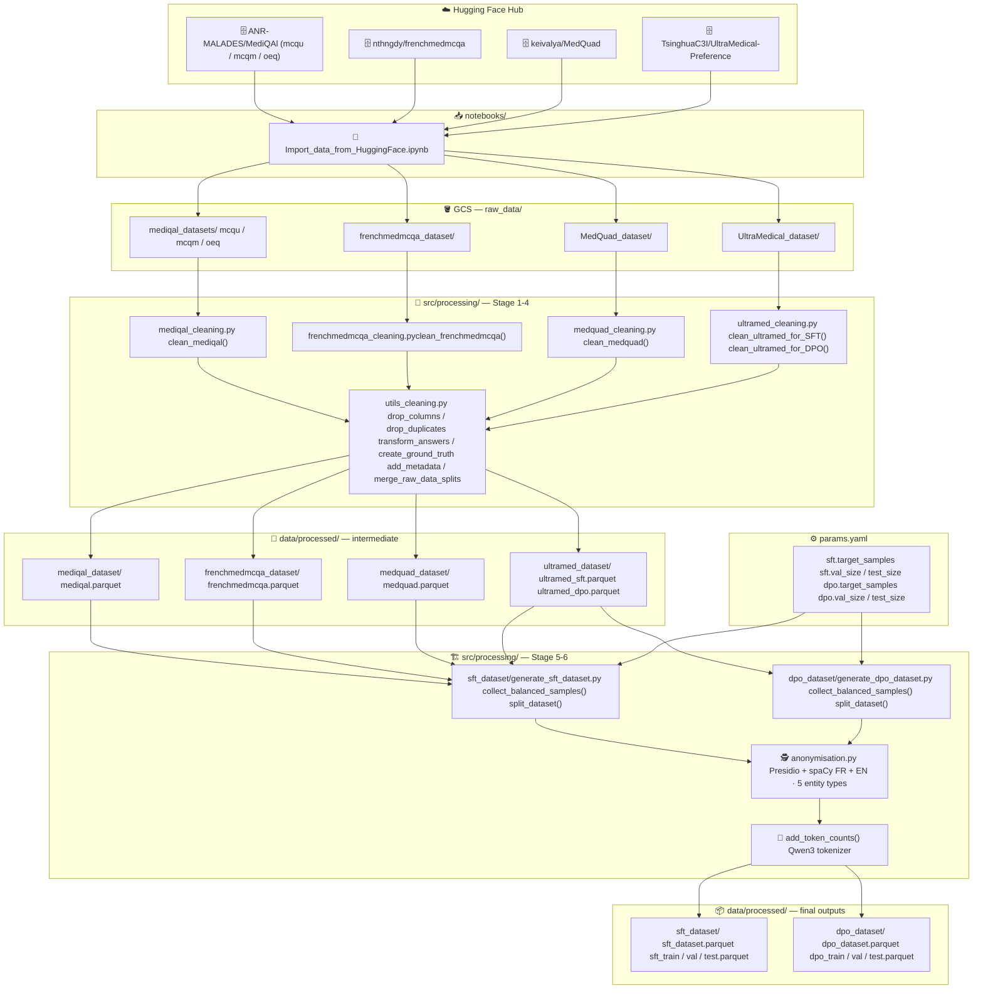

# 🩺 Fine-Tuning Medical — French Medical QA Dataset Pipeline

A data engineering pipeline that ingests, cleans, anonymizes, and prepares French-language medical QA
datasets for LLM fine-tuning. Targets multiple Hugging Face sources, normalizes them into unified
SFT `(question, answer)` and DPO `(question, chosen, rejected)` schemas, and persists the results
locally via a reproducible DVC pipeline.


---

## 🎯 Objective

Medical LLMs require high-quality, domain-specific training data — but raw datasets from the
community are heterogeneous, contain duplicates, irrelevant columns, inconsistent answer encodings,
and potentially identifiable information. This project standardizes four French and bilingual medical
QA corpora into clean SFT and DPO formats ready for supervised fine-tuning and preference training.

- 🗂️ Ingest datasets directly from Hugging Face Hub
- 🧹 Clean, deduplicate, and normalize each source independently
- 🔄 Resolve answer indices to their textual form and create a ground-truth `answer` column
- 🕵️ Anonymize PII (names, emails, phones, dates, locations) across FR and EN text
- 🏷️ Tag every row with source metadata (language, question type, confidence level, dataset name)
- 🔢 Count tokens using the Qwen3 tokenizer before any fine-tuning stage
- ⚖️ Sample a balanced, multi-source SFT dataset and a DPO preference dataset
- 🔁 Reproduce the full pipeline deterministically with a single `dvc repro`

---

## ✨ Features

- ✅ Dedicated cleaning pipeline for **MediQAL** (MCQU subset, French clinical MCQ)
- ✅ Dedicated cleaning pipeline for **FrenchMedMCQA** (595 / 164 / 321 split)
- ✅ Dedicated cleaning pipeline for **MedQuad** (16 407 English open-QA pairs)
- ✅ Dedicated cleaning pipeline for **UltraMedical-Preference** — outputs both SFT and DPO variants
- ✅ Shared utility layer: `drop_columns`, `drop_duplicates`, `transform_correct_answers_to_text`, `create_ground_truth_answer_column`, `add_metadata`, `add_token_counts`, `collect_balanced_samples`, `split_dataset`
- ✅ PII anonymization via **Presidio + spaCy** (FR + EN), 5 entity types: `PERSON`, `EMAIL_ADDRESS`, `PHONE_NUMBER`, `DATE_TIME`, `LOCATION` — auto-detected language with `langdetect` fallback
- ✅ Token counting with **Qwen3-1.7B-Base tokenizer** — adds `token_count_<col>` columns before splitting
- ✅ Balanced multi-source sampling with adaptive shortfall redistribution (`collect_balanced_samples`)
- ✅ Stratified train / val / test split on `dataset_name` via scikit-learn (`split_dataset`)
- ✅ Metadata tagging: `language`, `question_type`, `confidence_level`, `dataset_name` on every row
- ✅ Full **SFT dataset** generation: 5 000 balanced samples across 4 sources → train / val / test Parquet
- ✅ Full **DPO dataset** generation: 5 000 preference pairs from UltraMedical → train / val / test Parquet
- ✅ Clinical-case-aware filtering for MediQAL (retains only rows with an associated clinical case)
- ✅ Structured logging at every pipeline step via a centralized `config/logger.py`
- ✅ Reproducible **DVC pipeline** with 6 stages, `params.yaml` surface, and GCS remote tracking
- ✅ EDA notebooks for MediQAL, FrenchMedMCQA, MedQuad, UltraMedical, and the final SFT dataset
- ✅ Import notebook covering all four source datasets from Hugging Face Hub

---

## 📊 Architecture



---

## 📁 Project Structure

```
FINE-TUNING_MEDICAL/
│
├── 📂 config/
│   ├── __init__.py
│   ├── logger.py                         # Centralized logging configuration
│   └── paths.py                          # GCS + local path constants
│
├── 📂 data/
│   └── 📂 processed/                     # DVC-tracked outputs
│       ├── mediqal_dataset/
│       │   └── mediqal.parquet
│       ├── frenchmedmcqa_dataset/
│       │   └── frenchmedmcqa.parquet
│       ├── medquad_dataset/
│       │   └── medquad.parquet
│       ├── ultramed_dataset/
│       │   ├── ultramed_sft.parquet
│       │   └── ultramed_dpo.parquet
│       ├── sft_dataset/
│       │   ├── sft_dataset.parquet       # Full merged dataset
│       │   ├── sft_train.parquet
│       │   ├── sft_val.parquet
│       │   └── sft_test.parquet
│       └── dpo_dataset/
│           ├── dpo_dataset.parquet       # Full merged dataset
│           ├── dpo_train.parquet
│           ├── dpo_val.parquet
│           └── dpo_test.parquet
│
├── 📂 notebooks/
│   ├── __init__.py
│   ├── Import_data_from_HuggingFace.ipynb    # Ingest all sources → GCS
│   └── 📂 EDA/
│       ├── frenchmedmcqa_analysis.ipynb
│       ├── mediqal_analysis.ipynb
│       ├── medquad_analysis.ipynb
│       ├── sft_dataset_analysis.ipynb
│       └── ultramedical_analysis.ipynb
│
├── 📂 src/
│   └── 📂 processing/
│       ├── __init__.py
│       ├── mediqal_cleaning.py               # MediQAL cleaning pipeline
│       ├── frenchmedmcqa_cleaning.py         # FrenchMedMCQA cleaning pipeline
│       ├── medquad_cleaning.py               # MedQuad cleaning pipeline
│       ├── ultramed_cleaning.py              # UltraMedical SFT + DPO cleaning
│       ├── anonymisation.py                  # Presidio + spaCy PII anonymizer (FR/EN)
│       ├── utils_cleaning.py                 # Shared utilities (sampling, splitting, tokens…)
│       ├── 📂 sft_dataset/
│       │   └── generate_sft_dataset.py       # Stage 5 — balanced SFT assembly
│       └── 📂 dpo_dataset/
│           └── generate_dpo_dataset.py       # Stage 6 — DPO preference assembly
│
├── 🗂️ dvc.yaml                               # 6-stage DVC pipeline definition
├── 🗂️ dvc.lock                               # Locked hashes for reproducibility
├── 📦 params.yaml                            # Pipeline parameters (samples, splits, seeds)
├── 📦 pyproject.toml                         # Project metadata & dependencies (uv)
├── 📦 uv.lock                                # Locked dependency graph
└── .python-version                           # Python 3.13
```

---

## 🔁 DVC Pipeline

The full data preparation pipeline is defined in `dvc.yaml` and driven by `params.yaml`. Running
`dvc repro` executes all six stages in dependency order, skipping any stage whose inputs have not
changed since the last run.

### Stages (in execution order)

| # | Stage | Command | Output |
|---|---|---|---|
| 1 | `clean_mediqal` | `python -m src.processing.mediqal_cleaning` | `data/processed/mediqal_dataset/` |
| 2 | `clean_frenchmedmcqa` | `python -m src.processing.frenchmedmcqa_cleaning` | `data/processed/frenchmedmcqa_dataset/` |
| 3 | `clean_medquad` | `python -m src.processing.medquad_cleaning` | `data/processed/medquad_dataset/` |
| 4 | `clean_ultramed` | `python -m src.processing.ultramed_cleaning` | `data/processed/ultramed_dataset/` |
| 5 | `generate_sft` | `python -m src.processing.sft_dataset.generate_sft_dataset` | `data/processed/sft_dataset/` |
| 6 | `generate_dpo` | `python -m src.processing.dpo_dataset.generate_dpo_dataset` | `data/processed/dpo_dataset/` |

### Running the pipeline

```bash
# Reproduce all stages (only re-runs stages with changed inputs)
dvc repro

# Force re-run of all stages regardless of cache
dvc repro --force

# Check which stages are outdated without running them
dvc status
```

### Configuration surface — `params.yaml`

All tunable parameters live in `params.yaml`. Changing any value and re-running `dvc repro`
automatically invalidates the downstream stages.

```yaml
sft:
  target_samples: 5000     # Total rows in the final SFT dataset
  random_state: 42          # Reproducibility seed
  val_size: 0.2             # Fraction allocated to validation
  test_size: 0.1            # Fraction allocated to test
  source_datasets:          # Parquet files relative to data/processed/
    - mediqal_dataset/mediqal.parquet
    - frenchmedmcqa_dataset/frenchmedmcqa.parquet
    - medquad_dataset/medquad.parquet
    - ultramed_dataset/ultramed_SFT.parquet

dpo:
  target_samples: 5000
  random_state: 42
  val_size: 0.2
  test_size: 0.1
  source_datasets:
    - ultramed_dataset/ultramed_DPO.parquet
```

> 💡 Stages 5 and 6 declare their `params:` dependencies explicitly in `dvc.yaml`, so DVC detects
> parameter changes and only reruns those stages — not the cleaning stages.

---

## 🧠 Pipeline Logic

### Answer normalization

Both MCQ datasets encode correct answers differently. The shared utility
`transform_correct_answers_to_text` resolves the `correct_answers` column using a per-dataset
mapping dict, then `create_ground_truth_answer_column` looks up the actual answer text from the row:

```python
df["answer"] = df.apply(lambda row: row[row["correct_answer_text"]], axis=1)
```

This produces a clean `answer` column regardless of the original encoding scheme (letter string
vs. integer index).

### MediQAL-specific filtering

MediQAL MCQU rows without a linked clinical case are dropped before any other transformation.
Only rows where `clinical_case` is not null are retained, ensuring the cleaned dataset is
anchored to concrete clinical context.

### PII anonymization

`anonymisation.py` wraps Microsoft Presidio with a bilingual spaCy NLP engine. Language is
auto-detected per row via `langdetect` (fallback: `"en"`). Five entity types are replaced by
structured tags:

| Entity type | Replacement tag |
|---|---|
| `PERSON` | `<PERSON>` |
| `EMAIL_ADDRESS` | `<EMAIL>` |
| `PHONE_NUMBER` | `<PHONE>` |
| `DATE_TIME` | `<DATE>` |
| `LOCATION` | `<LOCATION>` |

For SFT, anonymization is applied to `question` and `answer`. For DPO, it covers `question`,
`chosen`, and `rejected`.

### Token counting

`add_token_counts()` loads the `Qwen/Qwen3-1.7B-Base` tokenizer once per process (via
`@lru_cache`) and adds a `token_count_<col>` column for each specified text column. This enables
length-aware filtering at the fine-tuning stage without re-tokenizing.

### Balanced multi-source sampling

`collect_balanced_samples()` distributes the `target_samples` quota evenly across all source
Parquet files. When a file has fewer rows than its share, the shortfall is redistributed to the
remaining files in the same pass — ensuring the final count stays as close to the target as
possible without oversampling any single source.

### Stratified splitting

`split_dataset()` uses `sklearn.model_selection.train_test_split` with `stratify=df['dataset_name']`
at both split levels (train/rest, then val/test), preserving source proportions across all three
splits.

### Dataset sizes

| Dataset | Format | Split | Raw rows | Processed rows |
|---|---|---|---|---|
| MediQAL MCQU | MCQ (FR) | train | 10 113 | — |
| MediQAL MCQU | MCQ (FR) | validation | 2 561 | — |
| MediQAL MCQU | MCQ (FR) | test | 4 343 | — |
| MediQAL MCQM | MCQ (FR) | train | 5 767 | — |
| MediQAL MCQM | MCQ (FR) | validation | 1 466 | — |
| MediQAL MCQM | MCQ (FR) | test | 3 384 | — |
| MediQAL OEQ | Open QA (FR) | test | 4 969 | — |
| FrenchMedMCQA | MCQ (FR) | train | 595 | — |
| FrenchMedMCQA | MCQ (FR) | validation | 164 | — |
| FrenchMedMCQA | MCQ (FR) | test | 321 | — |
| MedQuad | Open QA (EN) | train | 16 407 | `medquad.parquet` |
| UltraMedical-Preference | Conversational (EN) | train | 109 353 | `ultramed_sft.parquet` + `ultramed_dpo.parquet` |
| **SFT dataset** | `(question, answer)` | full | — | **5 000** (train 3 500 / val 1 000 / test 500) |
| **DPO dataset** | `(question, chosen, rejected)` | full | — | **5 000** (train 3 500 / val 1 000 / test 500) |

> 🔹 SFT schema: `question`, `answer`, `language`, `question_type`, `confidence_level`,
> `dataset_name`, `token_count_question`, `token_count_answer`

> 🔹 DPO schema: `question`, `chosen`, `rejected`, `language`, `question_type`,
> `confidence_level`, `dataset_name`, `token_count_question`, `token_count_chosen`,
> `token_count_rejected`

---

## 🚀 Installation

### Prerequisites

- Python **3.13** (enforced via `.python-version`)
- [uv](https://docs.astral.sh/uv/) package manager
- [DVC](https://dvc.org/) **3.67+** (included in the `dev` dependency group)
- A Google Cloud project with a GCS bucket named `p14-medical-data` (or equivalent)
- Application Default Credentials configured: `gcloud auth application-default login`

### Setup

```bash
# 1. Clone the repository
git clone https://github.com/RandomFab/FINE-TUNING_MEDICAL.git
cd FINE-TUNING_MEDICAL

# 2. Create and activate the virtual environment (includes dev dependencies)
uv sync --all-groups

# On Linux / macOS
source .venv/bin/activate

# On Windows (PowerShell)
.venv\Scripts\Activate.ps1

# 3. Download spaCy language models (required by the anonymization module)
python -m spacy download fr_core_news_md
python -m spacy download en_core_web_md
```

### Running the ingestion notebook

```bash
jupyter notebook notebooks/Import_data_from_HuggingFace.ipynb
```

> 💡 A Hugging Face token is optional but recommended to avoid rate-limiting on large datasets
> (e.g. UltraMedical-Preference at ~994 MB). Set it via `export HF_TOKEN=<your_token>` before
> launching the notebook.

### Running the full pipeline (recommended)

```bash
# Reproduce all 6 stages in order, using DVC cache
dvc repro
```

### Running individual stages

```bash
# Stage 1 — Clean MediQAL
python -m src.processing.mediqal_cleaning

# Stage 2 — Clean FrenchMedMCQA
python -m src.processing.frenchmedmcqa_cleaning

# Stage 3 — Clean MedQuad
python -m src.processing.medquad_cleaning

# Stage 4 — Clean UltraMedical (outputs both SFT and DPO variants)
python -m src.processing.ultramed_cleaning

# Stage 5 — Generate SFT dataset (reads params.yaml)
python -m src.processing.sft_dataset.generate_sft_dataset

# Stage 6 — Generate DPO dataset (reads params.yaml)
python -m src.processing.dpo_dataset.generate_dpo_dataset
```

All scripts read from `gs://p14-medical-data/raw_data/` (stages 1–4) or from
`data/processed/` (stages 5–6), and write Parquet files to `data/processed/`.

> ⚠️ Make sure the GCS bucket exists and your service account has `Storage Object Admin` rights
> before running stages 1–4.

---

## 🔭 Long-term Vision

This pipeline is the data preparation stage of a broader medical LLM fine-tuning project.
Planned next steps:

- Fine-tune a base LLM (e.g. Qwen3, Mistral) using SFT on the `(question, answer)` pairs
- Evaluate on held-out medical benchmarks (FrenchMedMCQA test split)
- Apply RLHF/DPO using the generated `(question, chosen, rejected)` preference dataset

---

## 👤 Author

**RandomFab - Fabien BARDOUIL**
