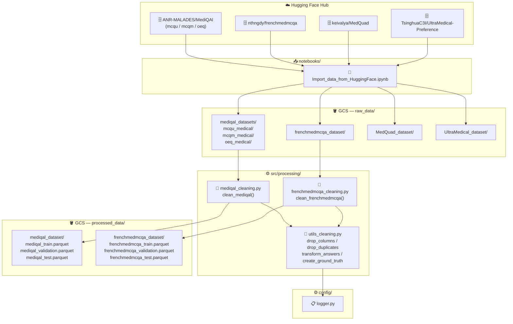

# 🩺 Fine-Tuning Medical — French Medical QA Dataset Pipeline

A data engineering pipeline that ingests, cleans, and prepares French-language medical QA datasets
for LLM fine-tuning. Targets multiple Hugging Face sources, normalizes them into a unified
`(question, answer)` schema, and persists the results to Google Cloud Storage.


---

## 🎯 Objective

Medical LLMs require high-quality, domain-specific training data — but raw datasets from the
community are heterogeneous, contain duplicates, irrelevant columns, and inconsistent answer
encodings. This project standardizes four French and bilingual medical QA corpora into a single
clean format ready for supervised fine-tuning (SFT) or RLHF preference training.

- 🗂️ Ingest datasets directly from Hugging Face Hub
- 🧹 Clean, deduplicate, and normalize each source independently
- 🔄 Resolve answer indices to their textual form and create a ground-truth `answer` column
- ☁️ Persist processed splits (train / validation / test) to GCS as Parquet files

---

## ✨ Features

- ✅ Dedicated cleaning pipeline for **MediQAL** (MCQU subset, French clinical MCQ)
- ✅ Dedicated cleaning pipeline for **FrenchMedMCQA** (595 / 164 / 321 split)
- ✅ Shared utility layer: `drop_columns`, `drop_duplicates`, `transform_correct_answers_to_text`, `create_ground_truth_answer_column`
- ✅ Clinical-case-aware filtering for MediQAL (retains only rows with an associated clinical case)
- ✅ Structured logging at every pipeline step via a centralized `config/logger.py`
- ✅ GCS upload in Parquet format with error handling and file-size reporting
- ✅ EDA notebooks for both MediQAL and FrenchMedMCQA datasets
- ✅ Import notebook covering four source datasets: MediQAL (MCQU / MCQM / OEQ), FrenchMedMCQA, MedQuad, UltraMedical-Preference

---

## 📊 Architecture



---

## 📁 Project Structure

```
FINE-TUNING_MEDICAL/
│
├── 📂 config/
│   ├── __init__.py
│   └── logger.py                  # Centralized logging configuration
│
├── 📂 notebooks/
│   ├── __init__.py
│   ├── Import_data_from_HuggingFace.ipynb   # Ingest all sources → GCS
│   └── 📂 EDA/
│       ├── frenchmedmcqa_analysis.ipynb     # EDA on FrenchMedMCQA
│       └── mediqal_analysis.ipynb           # EDA on MediQAL
│
├── 📂 src/
│   └── 📂 processing/
│       ├── __init__.py
│       ├── mediqal_cleaning.py              # MediQAL cleaning pipeline
│       ├── frenchmedmcqa_cleaning.py        # FrenchMedMCQA cleaning pipeline
│       └── utils_cleaning.py               # Shared cleaning utilities
│
├── __init__.py
├── 📦 pyproject.toml                        # Project metadata & dependencies (uv)
├── 📦 uv.lock                               # Locked dependency graph
└── .python-version                          # Python 3.13
```

---

## 🧠 Pipeline Logic

### Answer normalization

Both datasets encode correct answers differently. The shared utility
`transform_correct_answers_to_text` resolves the `correct_answers` column using a per-dataset
mapping dict, then `create_ground_truth_answer_column` uses that resolved column name to look up
the actual answer text from the row:

```python
df["answer"] = df.apply(lambda row: row[row["correct_answer_text"]], axis=1)
```

This produces a clean `answer` column regardless of the original encoding scheme (letter string
vs. integer index).

### MediQAL-specific filtering

MediQAL MCQU rows without a linked clinical case are dropped before any other transformation.
Only rows where `clinical_case` is not null are retained, ensuring the cleaned dataset is
anchored to concrete clinical context.

### Dataset sizes (raw)

| Dataset | Split | Rows |
|---|---|---|
| MediQAL MCQU | train | 10 113 |
| MediQAL MCQU | validation | 2 561 |
| MediQAL MCQU | test | 4 343 |
| MediQAL MCQM | train | 5 767 |
| MediQAL MCQM | validation | 1 466 |
| MediQAL MCQM | test | 3 384 |
| MediQAL OEQ | test | 4 969 |
| FrenchMedMCQA | train | 595 |
| FrenchMedMCQA | validation | 164 |
| FrenchMedMCQA | test | 321 |
| MedQuad | train | 16 407 |
| UltraMedical-Preference | train | 109 353 |

---

## 🚀 Installation

### Prerequisites

- Python **3.13** (enforced via `.python-version`)
- [uv](https://docs.astral.sh/uv/) package manager
- A Google Cloud project with a GCS bucket named `p14-medical-data` (or equivalent)
- Application Default Credentials configured: `gcloud auth application-default login`

### Setup

```bash
# 1. Clone the repository
git clone https://github.com/RandomFab/FINE-TUNING_MEDICAL.git
cd FINE-TUNING_MEDICAL

# 2. Create and activate the virtual environment
uv sync

# On Linux / macOS
source .venv/bin/activate

# On Windows (PowerShell)
.venv\Scripts\Activate.ps1
```

### Running the ingestion notebook

```bash
jupyter notebook notebooks/Import_data_from_HuggingFace.ipynb
```

> 💡 A Hugging Face token is optional but recommended to avoid rate-limiting on large datasets
> (e.g. UltraMedical-Preference at ~994 MB). Set it via `export HF_TOKEN=<your_token>` before
> launching the notebook.

### Running the cleaning scripts

```bash
# Clean MediQAL MCQU splits and upload to GCS
python -m src.processing.mediqal_cleaning

# Clean FrenchMedMCQA splits and upload to GCS
python -m src.processing.frenchmedmcqa_cleaning
```

Both scripts read from `gs://p14-medical-data/raw_data/` and write Parquet files to
`gs://p14-medical-data/processed_data/`.

> ⚠️ Make sure the GCS bucket exists and your service account has `Storage Object Admin` rights
> before running the cleaning scripts.

---

## 🔭 Long-term Vision

This pipeline is the data preparation stage of a broader medical LLM fine-tuning project.
Planned next steps:

- Merge cleaned corpora into a unified instruction dataset
- Fine-tune a base LLM (e.g. Mistral, LLaMA) using SFT on the `(question, answer)` pairs
- Evaluate on held-out medical benchmarks (FrenchMedMCQA test split)
- Explore RLHF/DPO using the UltraMedical-Preference `(chosen, rejected)` pairs

---

## 👤 Author

**RandomFab - Fabien BARDOUIL**
